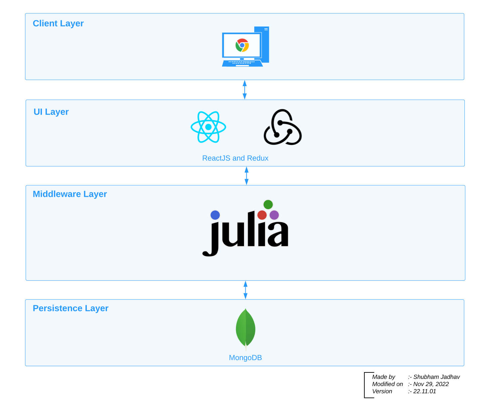
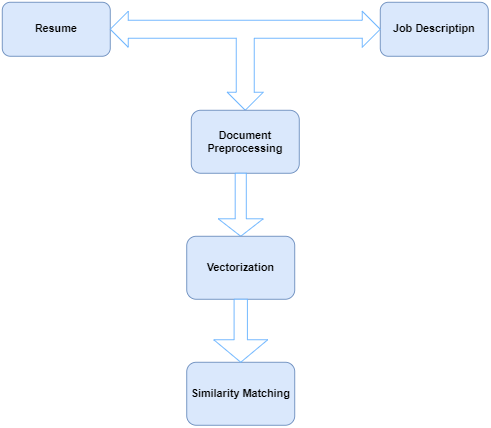
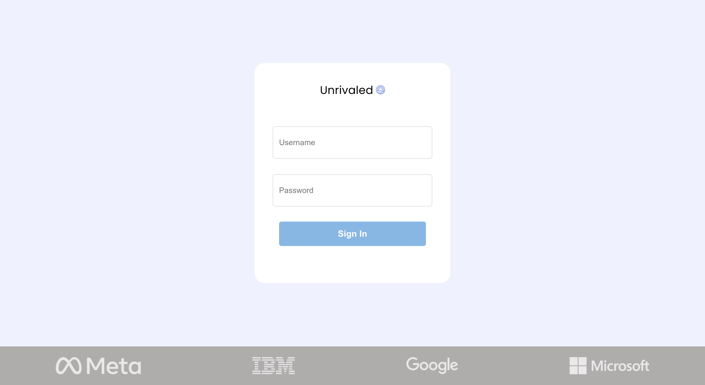

# Unrivaled

## Contents

- [Files and Folder Structure](#files-and-folder-structure)
  * [Julia Server](#julia-server)
  * [Julia NLP Engine](#julia-nlp-engine)
  * [DB Connection](#db-connection)
  * [UI](#ui)
- [Architecture Diagram](#architecture-diagram)
- [NLP Process Flow](#nlp-process-flow)
- [Software Requirements](#software-requirements)
- [Setup and Installation](#setup-and-installation)
  * [To run server](#to-run-server)
  * [To run UI](#to-run-ui)
- [Project Flow](#project-flow)
- [How It Works](#how-it-works)
- [Project Demo](#project-demo)
- [Coding Practices](#coding-practices)
  * [Naming Conventions](#naming-conventions)
  * [Comments](#comments)
  * [Commits](#commits)
  * [Format and Styles](#format-and-styles)

## Files and Folder Structure

### Julia Server
 * This folder contains middleware programmed in Julia
 * It has API handlers and functions to connect to NLP Engine and Database connectivity

### Julia NLP Engine
 * It contains NLP program that takes resume and job description to output similary scores and metrics
 * This folder also contains Embedding files

### DB Connection
 * It contains program to connect to MongoDB Database and perform CRUD operations

### UI
 * This folder contains programs for UI
 * We have used ReactJS with Redux to implement the UI

## Architecture Diagram

## NLP Process Flow

## Software Requirements
 * [Julia](https://julialang.org/downloads/)
 * [MongoDB](https://www.mongodb.com/docs/manual/administration/install-community/)
 * [NodeJS](https://nodejs.org/en/download/)
 * [Node Package Manager](https://docs.npmjs.com/downloading-and-installing-node-js-and-npm)
 * [ReactJS](https://reactjs.org/docs/getting-started.html)

## Setup and Installation

### To run server
 * Open terminal
 * Clone the repository to you local directory
 * Change directory to "Unrivaled/Julia_NLP_Engine"
 * Create a empty directory "Embeddings"
 * Go to this website https://nlp.stanford.edu/projects/glove/
 * Download the Embeddings, extract it and place the 50d.txt file in the newly created directory in "Julia_NLP_Engine"
 * Change directory to "Unrivaled/Julia_Server"
 * Run command: julia server.js

### To run UI
 * Open terminal
 * Change directory to "Unrivaled/UI"
 * Run command: npm install && npm start
 
## Project Flow
 1. Authentication
    * The user has to login with their user name and password

 2. Upload Resume
    * The user uploads the resume that their wants to compare it with the job descreption
    * In this version, we are accepting pdf file formats and the user is able to upload one resume for one score output
    * In future versions, we will add docx file as a file upload option and also the user will be able to upload multiple resumes to compare with the job descreption and choose the one that matches the most

 3. Upload Job Descreption
    * The user uploads the job descreption that their wants to mathc with the resume uploaded
    * In this version, we are accepting pdf file formats
    * In future versions, we will add docx file as a file upload option

 4. Store data in Database
    * After the file is uploaded, it will be converted to base64 format, so that it is suitable to be stored in the database, and is stored in our respective collection.
    * Resumes will be stored in resume collection and job descreptions in the job descreption collection

 5. Files retrieved, processed, and scores are stored in the database
    * Corresponding files (resume and job descreption for the respective user) will be retrived from the database and get processed. Key words found in both files and 
      important features are then used to score the match of resume to the job descreption
    * Then, the score and other outputs (keywords, word count, etc.) are stored in the database

 6. Display results
    * Finally, the output result will be displayed to the user.

## How It Works
 1. Create a dictionary of both jd and resume and then create vectors of both resume and jd
    * We will retrive the base64 format of both the resume and the job description from our respective collection
    * We will convert them to a string that they will be suitalbe to work with
    * Store the frequency of each word after removing stop words that are not necessary
    * Then we create the vectors (Here I need Jahnavi's help to make it technical)

 2. Finding keywords in both jd and resume after removing stop words and unnecessary things
    * We used "languages" library to find keywords in our resume and job description

 3. Finding similarities between the two vectors
    * We used "GloVe" to create the vectors for both the resume and job description. GloVe is an unsupervised learning algorithm for obtaining vector representations for 
      words

 4. Create score based on the similarity
    * We used "cosine similarity and correlation" between the two vectors and then create the score based on that. Cosine similarity measures the similarity between two 
      vectors of an inner product space. It is measured by the cosine of the angle between two vectors and determines whether two vectors are pointing in roughly the same 
      direction. It is often used to measure document similarity in text analysis

## Project Demo

## Coding Practices

### Naming Conventions
* Variables and Functions name - names concatenated with underscore | Ex: big_mouse
* Struct/Class name - camel case | Ex: bigMouse
 
### Comments
* Every file should have indtroductory comments stating
  * Name
  * Description
  * Created Date
  * Author
 * Every function should have comments explaining the implementation
 
### Commits
 * Try to commit every day
 * Commit for every file that is completed
 * Commit for every implementatation of a method/function
 * Commit message should be meaningful - It should be able to answer: What you did to achieve what
 
### Format and Styles
 * Tabs should be of 4 spaces
 * Indentation should be followed every where
 * Font: San-serif
 * UI color scheme: Blue
